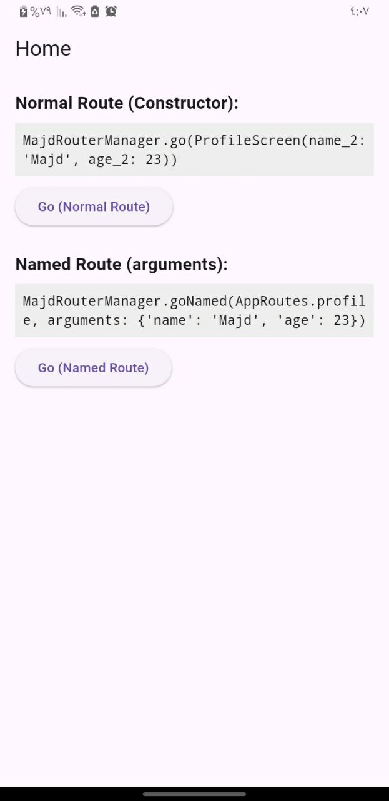
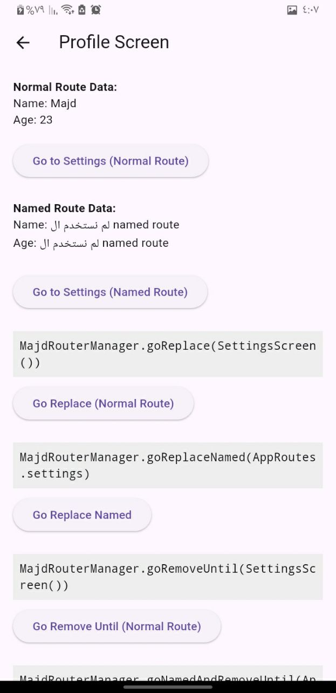
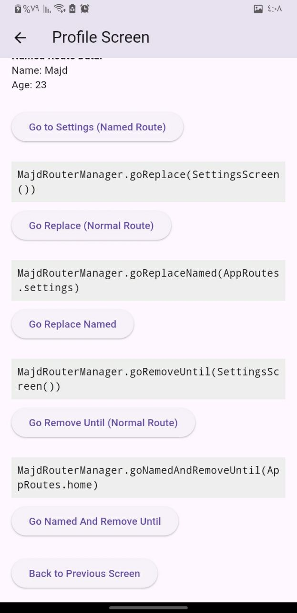
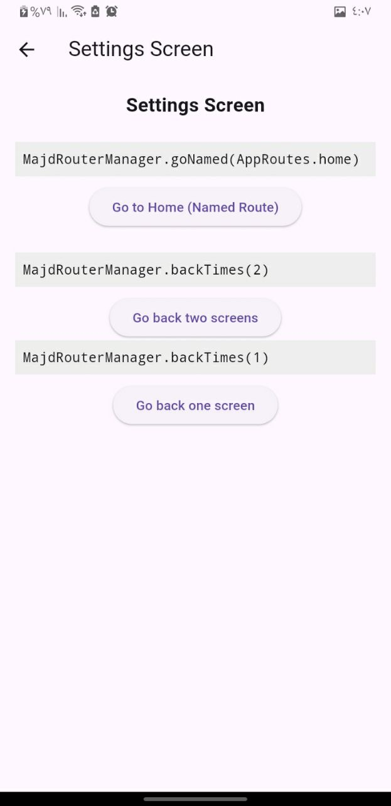

# Majd Router Manager 

**الوصف** 
---
هو مشروع Flutter  يوضح كيفية إدارة **التنقل بين الشاشات** باستخدام **Route Manager خاص**، مع دعم كل أنواع التنقل وتمريرة البيانات بين الشاشات.

---

## ⚡ الميزات الرئيسية:

1. **Normal Route Navigation**

   * تمرير البيانات عبر **constructor** مباشرة إلى الشاشة التالية.

2. **Named Route Navigation**

   * تمرير البيانات عبر `arguments` باستخدام أسماء المسارات.

3. **Go Replace / Go Replace Named**

   * استبدال الشاشة الحالية بشاشة جديدة.

4. **Go Remove Until / Go Named And Remove Until**

   * حذف الشاشات السابقة في الـ stack حتى الوصول للشاشة المطلوبة.

5. **Back Navigation**

   * العودة للشاشة السابقة أو العودة لعدد معين من الشاشات.

6. **واجهة تعليمية منظمة**

   * كل زر مع **الكود المسؤول عن التنقل أعلاه** لتسهيل الشرح والفهم.

---

## 🖼️ الشاشات الموجودة:

* **HomeScreen**: واجهة البداية، تحتوي على أزرار التنقل Normal و Named Route مع تمرير البيانات.
* **ProfileScreen**: تعرض البيانات المرسلة من الشاشة السابقة مع كل أنواع التنقل المتقدمة.
* **SettingsScreen**: تحتوي على أزرار للعودة، العودة لعدد معين من الشاشات، والانتقال إلى Home.

---

## 📦 الملفات المهمة:

* `majd_router_manager.dart`: كلاس مخصص لإدارة كل أنواع التنقل (go, goNamed, goReplace, goRemoveUntil, ...).
* `routes/app_routes.dart`: جميع المسارات المسماة للمشروع.
* `routes/app_pages.dart`: خرائط Route مع جميع الشاشات.
* `screen/`: مجلد يحتوي على كل الشاشات (`HomeScreen`, `ProfileScreen`, `SettingsScreen`).

---

## 🛠️ كيفية التشغيل:

1. تأكد من تثبيت Flutter و Android Studio أو VS Code.
2. توليد الملفات الناقصة.
3. اشغل المشروع:

```bash
flutter create .
flutter pub get
flutter run
```

> ستظهر لك واجهة تعليمية لكل أنواع التنقل مع عرض الكود أسفل كل زر.

---

### الصور
### Home Screen


### Profile Screen



### Settings Screen

